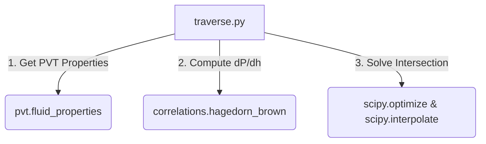

# Engine Traverse Module (traverse.py)

This module serves as the primary computational engine for the Nodal Analysis application. It handles the depth-by-depth pressure traverse integration, Vertical Lift Performance (VLP) curve construction, and the final operating point calculation by intersecting VLP with the Inflow Performance Relationship (IPR).

---

## Key Calculations & Workflows

### 1. Geothermal Temperature Gradient
The wellbore temperature profile is assumed to follow a linear geothermal gradient from the surface to the bottom-hole depth:

$$T(z) = T_{\text{surf}} + (T_{\text{bh}} - T_{\text{surf}}) \times \left(\frac{z}{H}\right)$$

where:
*   $T(z)$ is the local temperature at depth $z$ ($^\circ\text{F}$).
*   $T_{\text{surf}}$ is the surface temperature ($^\circ\text{F}$).
*   $T_{\text{bh}}$ is the bottom-hole temperature ($^\circ\text{F}$).
*   $z$ is the current depth (ft).
*   $H$ is the total well depth (ft).

---

### 2. Pressure Traverse Integration (VLP Point)
To compute the Bottom Hole Pressure (BHP) at a given oil rate ($q_o$), the module performs a forward step-by-step numerical integration (marching method) from the surface ($z = 0$) down to the bottom-hole ($z = H$).

The wellbore is discretized into $N$ steps of length $\Delta z = H / N$. At each step $j$:
1.  **Calculate Temperature**: Evaluate the local temperature $T_j$ at depth $z_j$.
2.  **Retrieve Fluid Properties**: Invoke `fluid_properties_at_PT` using the current pressure $p_j$ and temperature $T_j$ to get the PVT property dictionary `fp`.
3.  **Evaluate Pressure Gradient**: Call the modified Hagedorn-Brown `pressure_gradient(fp, roughness)` to obtain $(dp/dh)_j$ in **psi/ft**.
4.  **Apply Safeguard Clamps**: The gradient is constrained to:
    $$0.01 \le \frac{dp}{dh} \le 2.0 \text{ psi/ft}$$
5.  **Marching Step**: Update the pressure for the next depth node:
    $$p_{j+1} = p_j + \left(\frac{dp}{dh}\right)_j \Delta z$$

---

### 3. VLP Curve Generation
A VLP curve represents the relationship between the well's production rate and the required bottom-hole flowing pressure ($P_{wf}$). The module builds this curve by repeating the pressure traverse calculation across a range of oil production rates:
*   **Water rate ($q_w$)** scales dynamically with the oil rate: $q_w = q_o \times \text{WOR}$ (STB/day).
*   **Gas rate ($q_g$)** scales dynamically with the oil rate: $q_g = q_o \times \text{GOR} / 1000$ (Mscf/day).

---

### 4. Operating Point Intersection (VLP vs. IPR)
To find the well's operating production rate and pressure, the module locates the intersection of the VLP and IPR curves. 
1.  Both curves are interpolated linearly using `scipy.interpolate.interp1d`.
2.  A difference function is constructed:
    $$\Delta p(q) = p_{\text{VLP}}(q) - p_{\text{IPR}}(q)$$
3.  The root of this difference function ($\Delta p(q) = 0$) is found using Brent's method (`scipy.optimize.brentq`).
4.  If multiple intersections are found (e.g. under unstable flow conditions where the VLP curve shows a minimum), the module returns the **highest-rate intersection**, representing the stable operating point of the well.

---

## Function Reference

### `temperature_at_depth(depth, total_depth, T_surf, T_bh)`
Returns the linear geothermal temperature ($^\circ\text{F}$) at a given depth.

### `compute_vlp_point(...)`
Marches from the surface to the bottom-hole to calculate the flowing bottom-hole pressure for a single oil rate.
*   **Key inputs**: $q_o$, wellhead pressure ($whp$), depth, fluid parameters ($WOR, GOR$, API gravities, tubing diameter), and roughness.
*   **Returns**: Flowing bottom-hole pressure ($p_{\text{wf}}$ in psia).

### `compute_vlp_curve(...)`
Generates arrays of rates and bottom-hole pressures spanning a range between `rate_min` and `rate_max`.
*   **Returns**: `(rates, bhps)` as numpy arrays.

### `find_operating_point(vlp_rates, vlp_bhps, ipr_rates, ipr_pwfs)`
Finds the intersection point between the VLP and IPR curves.
*   **Returns**: `(operating_rate, operating_pressure)` or `(None, None)` if no intersection exists.

---

## Module Integrations

